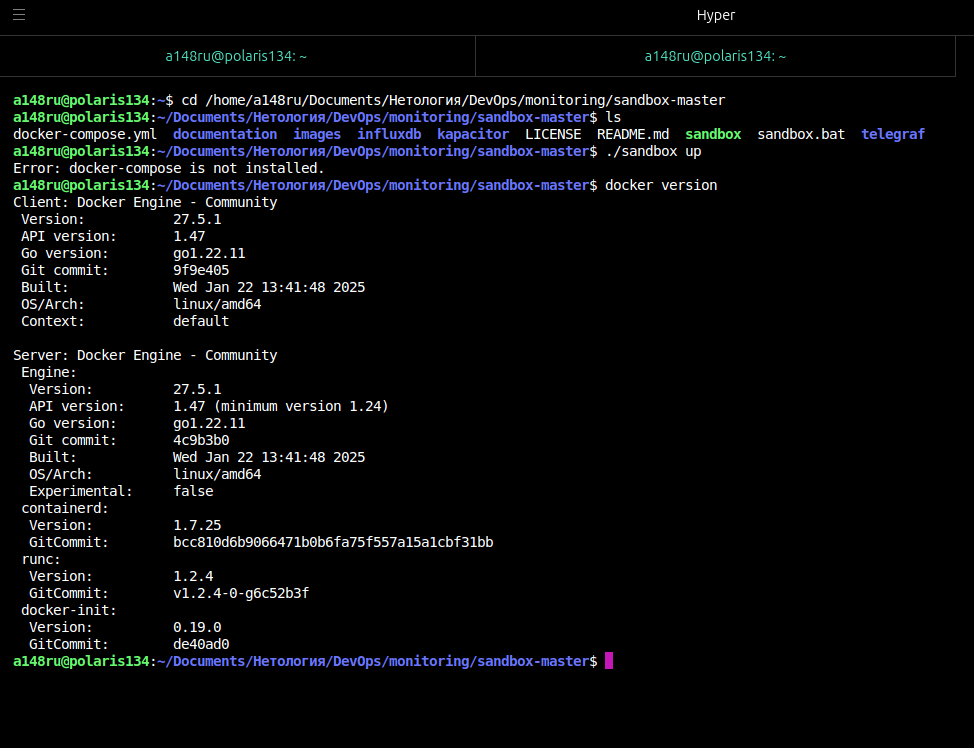
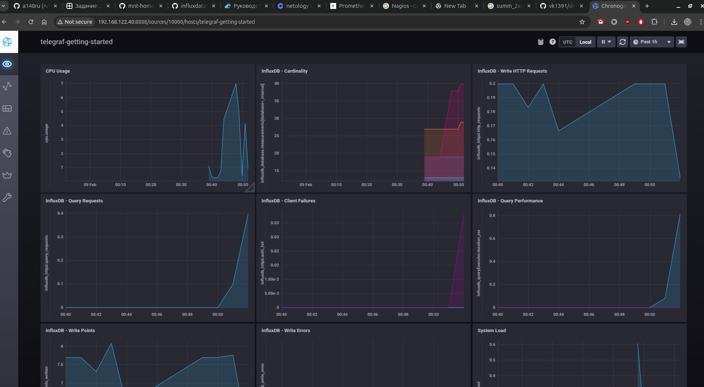
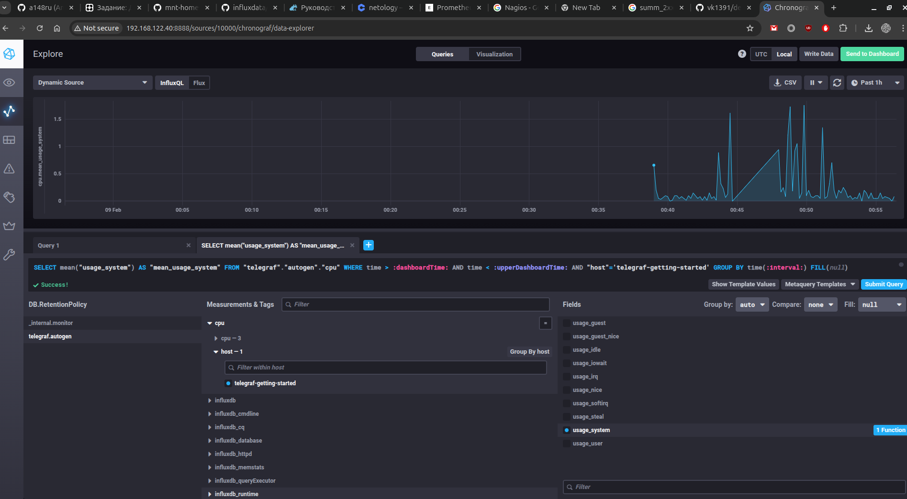
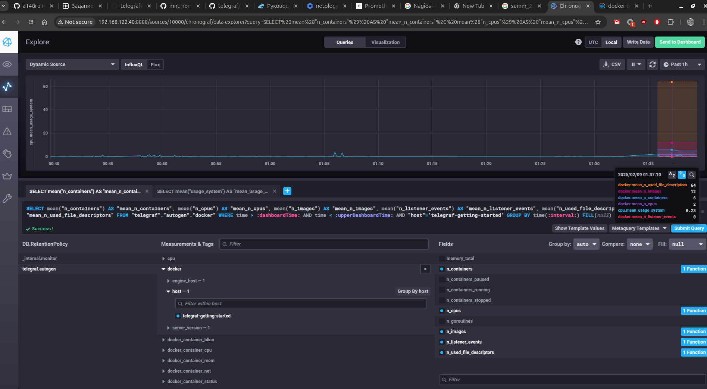

# Домашнее задание к занятию "13.Системы мониторинга"

## Обязательные задания

1. эти:

- **загрузка CPU** 
- ОЗУ/swap (лишним не будет)
- **загрузка диска - операции ввода-вывода (IOPS) и время выполнения оераций (latency)**
- **http запросы - количество**
- http ответы по категориям: корректные, редиректы, **ошибки 4хх и 5хх отдельно**.

2.  определить и согласовать с ним уровни и условия SLA

3. т.к. с бюджетом беда, и ресурсов, наверное, нет совсем, могу предложить разработчикам, добавить в приложения отправку логов на почту или в мессенджер.

4.  _*requests_ ? для подсчета ответов метрика называется запросы? ну ок, есть еще инфо и редиректы, их тоже стоит учитывать в формуле, если конечно система работает корректно и нет ошибок в самой программе. 

5. основные плюсы и минусы pull и push систем мониторинга.

**Push-модель системы мониторинга** — это подход, при котором данные или уведомления отправляются от источника к получателю без необходимости запрашивать их.
Из плюсов можно выделить:

 - Своевременность уведомлений - push-модель позволяет мгновенно получать информацию о событиях.
 - Снижение нагрузки на сеть - уменьшается количество запросов к серверу, так как данные отправляются только по мере необходимости.
 - Упрощение архитектуры - получатели не должны реализовывать сложные механизмы опроса.
 - Адаптация под события - Система может быть настроена на отправку только тех данных, которые действительно важны для пользователя.

Из минусов:

 - Зависимость от качества сети - если сеть нестабильна, уведомления могут не доходить до получателя, что приводит к потере информации.
 - Сложность обработки ошибок - в случае сбоя в передаче данных может потребоваться сложный механизм для повторной отправки.
 - Потенциальная перегрузка информации - Пользователи могут получать слишком много уведомлений, что приводит к "информационной перегрузке" и снижению внимания к важным сообщениям.
 -  Безопасность данных - Передача данных по сети может быть подвержена перехвату или другим угрозам, что требует дополнительных мер безопасности.

**Pull-модель системы мониторинга** — это подход, при котором получатель самостоятельно запрашивает данные у источника по мере необходимости. Рассмотрим основные плюсы и минусы этой модели.
Плюсы:
 - Контроль за запросами - получатели могут самостоятельно определять, когда и как часто им запрашивать данные, что позволяет оптимизировать использование ресурсов.
 - Устойчивость к сбоям - если источник данных недоступен, получатели могут продолжать запрашивать данные позже, что снижает риск потери информации.
 - Простота реализации - Pull-модель часто проще в реализации, так как не требует сложных механизмов для отправки уведомлений.
 - Снижение нагрузки на сервер - запросы могут быть распределены по времени, что позволяет избежать перегрузки сервера в пиковые моменты.
 - Безопасность данных - данные запрашиваются по мере необходимости, что может снизить риски утечки информации, так как нет постоянной передачи данных.

Минусы:
 - Задержка в получении данных - получатели могут не получать информацию мгновенно, что может быть критичным в ситуациях, требующих оперативного реагирования.
 - Нагрузка на сеть - частые запросы к серверу могут создавать дополнительную нагрузку на сеть, особенно если множество клиентов запрашивают данные одновременно.
 - Неэффективность для событийных данных - если система должна реагировать на события в реальном времени, pull-модель может оказаться неэффективной, так как пользователи могут пропустить важные обновления.
 - Необходимость управления частотой запросов - получатели должны самостоятельно управлять частотой запросов, что может привести к избыточным или недостаточным запросам.

6. Какие из ниже перечисленных систем относятся к push модели, а какие к pull? А может есть гибридные?

    - Prometheus - pull
    - TICK - push
    - Zabbix - гибрид
    - VictoriaMetrics -гибрид
    - Nagios - на сколько я смог понять поддерживат и pull и push

7. 

кайф

ок, вм, и docker-compose

8. 

9. 

