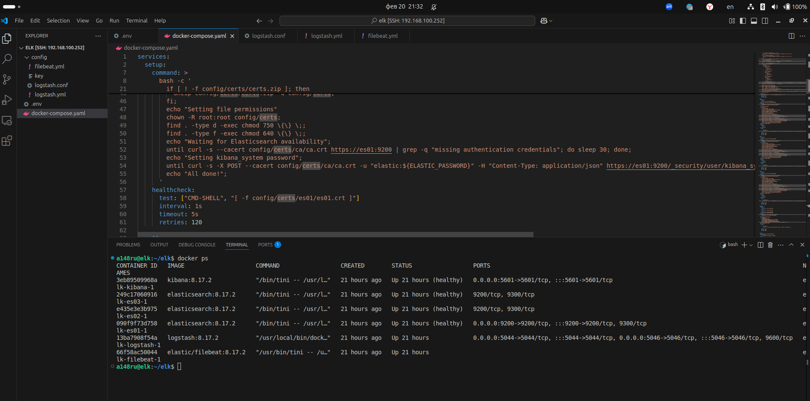
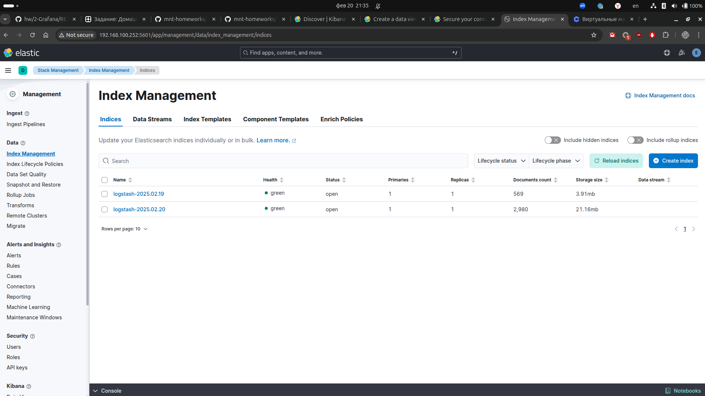
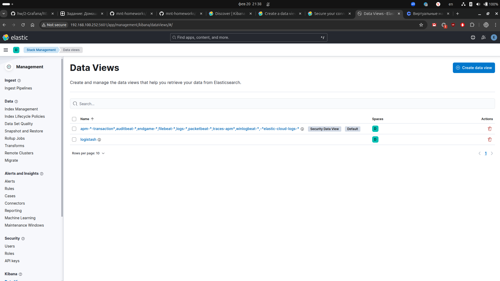
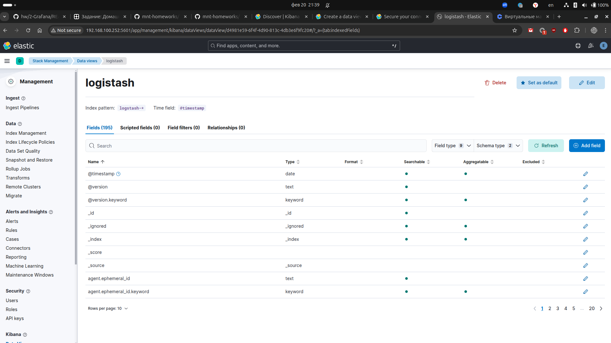
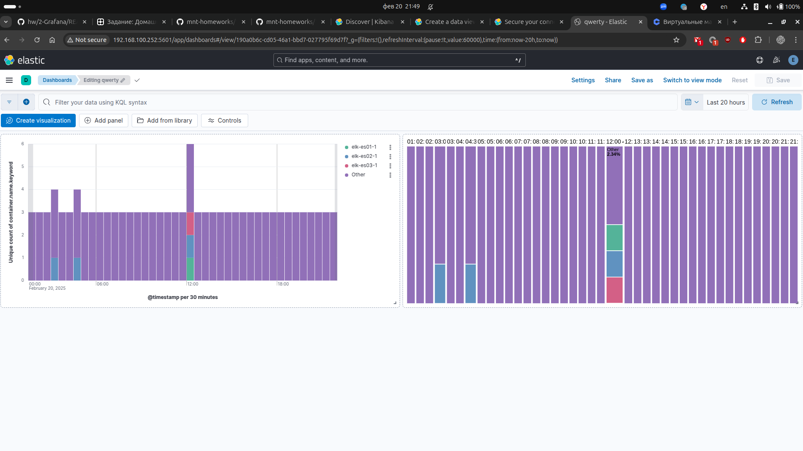

1.

[docker-compose.yaml](../elk/docker-compose.yaml)

config files:

- [filebeat.yml](../elk/config/filebeat.yml)
- [logstash.yml](../elk/config/logstash.yml)
- [logstash.conf](../elk/config/logstash.conf)

2.

